AyanokojiKiyotaka2010

CSE Student · Software Developer · Researcher · Problem Solver

 

About Me

I'm a Computer Science and Engineering student interested in the intersection of:

Algorithms and problem solving

Software engineering and system design

Artificial Intelligence and Machine Learning

Computer Vision and Deep Learning

Computational mathematics and research

Databases and backend systems

Systems programming and developer tooling

I prefer understanding why something works rather than treating a tool, framework, or abstraction as a black box.

Build → Understand → Experiment → Measure → Optimize

Research & Technical Interests

Area

Focus

Algorithms

Data Structures · Optimization · Problem Solving

Computational Mathematics

Number Theory · Experimental Mathematics · Performance Analysis

Artificial Intelligence

Machine Learning · Deep Learning · Intelligent Systems

Computer Vision

Object Detection · OCR · Image Processing

Software Engineering

Backend Systems · APIs · Databases · System Design

Systems

C/C++ · Low-Level Programming · Developer Tools

Research

Algorithmic Experiments · Reproducibility · Computational Analysis

Tech Stack

Programming Languages

C · C++ · Java · Python · JavaScript · TypeScript · SQL

AI / ML / Computer Vision

Machine Learning · Deep Learning · Computer Vision · Object Detection · OCR · Image Processing

Web / Backend

HTML · CSS · Tailwind CSS · Next.js · Node.js · Express.js

Databases

MySQL · MongoDB

Tools & Engineering

Git · GitHub · VS Code · LaTeX

Selected Work

Research

geo-sum-prime-research

C · Computational Number Theory · Experimental Research

Research-oriented computational work involving prime-related mathematical problems and algorithmic experimentation.

Visibility: Public

Systems & Algorithms

chess-engine

C++ · Algorithms · Search · Game Systems

A chess-engine project focused on algorithmic search, board-state handling, and systems-oriented implementation.

Visibility: Private · In Development

Software Engineering

problem-tracker

TypeScript · Productivity · Spaced Repetition · Search

A problem-tracking system with spaced repetition, gap analysis, fuzzy search, and bulk operations.

Visibility: Private · In Development

Systems Programming

codecrafters-shell-c

C · Shell · Systems Programming

Implementation-oriented work exploring shell behavior and systems-level programming concepts.

Visibility: Private · In Development

Developer Tools / AI Systems

codecrafters-claude-code-cpp

C++ · Developer Tools · AI Coding Systems

Implementation-oriented exploration of developer tooling and AI-assisted coding systems.

Visibility: Private · In Development

Computer Vision / AI

UrbanSight

Computer Vision · Vehicle Detection · Tracking · OCR

A computer-vision system focused on vehicle analysis, tracking, number-plate processing, OCR, and traffic intelligence.

Visibility: In Development

AI / Context Systems

NeuralFlow

AI Workspace · Context Systems · Software Architecture

A system for organizing, compiling, and managing context across AI-oriented workflows and developer environments.

Visibility: In Development

Other Work

Project

Focus

Status

AURA-repo

Software / Web

In Development

portfolio-website

Web Development

In Development

jay-parmar-portfolio

Web Development

In Development

Open Source & Collaboration

I also contribute to projects outside my own repositories.

Scope-creeps

Contributed to Kirtanagrawal916/Scope-creeps, with work tracked through GitHub's contribution history.

GitHub Analytics

Profile Overview

<picture>
<source media="(prefers-color-scheme: dark)" srcset="./assets/profile/overview.dark.svg">

</picture>

Contribution History

<picture>
<source media="(prefers-color-scheme: dark)" srcset="./assets/profile/lifetime.dark.svg">

</picture>

Contributions & Streak

<picture>
<source media="(prefers-color-scheme: dark)" srcset="./assets/profile/contributions.dark.svg">

</picture>

Contribution Composition

<picture>
<source media="(prefers-color-scheme: dark)" srcset="./assets/profile/composition.dark.svg">

</picture>

Activity Rhythm

<picture>
<source media="(prefers-color-scheme: dark)" srcset="./assets/profile/rhythm.dark.svg">

</picture>

Language Distribution

<picture>
<source media="(prefers-color-scheme: dark)" srcset="./assets/profile/languages.dark.svg">

</picture>

Engineering & Research Approach

        ┌──────────────────────┐
        │      Understand      │
        │   the problem first  │
        └──────────┬───────────┘
                   │
                   ▼
        ┌──────────────────────┐
        │     Study Theory     │
        │   and constraints    │
        └──────────┬───────────┘
                   │
                   ▼
        ┌──────────────────────┐
        │      Implement       │
        │   a working system   │
        └──────────┬───────────┘
                   │
                   ▼
        ┌──────────────────────┐
        │       Measure        │
        │ performance/behavior │
        └──────────┬───────────┘
                   │
                   ▼
        ┌──────────────────────┐
        │      Optimize        │
        │ identify bottlenecks │
        └──────────┬───────────┘
                   │
                   ▼
        ┌──────────────────────┐
        │   Document & Repeat  │
        └──────────────────────┘

The objective is not simply to make something work, but to understand why it works, how it behaves, and where it can be improved.

Current Direction

Computer Science
│
├── Algorithms
│   ├── Data Structures
│   ├── Optimization
│   └── Problem Solving
│
├── Computational Research
│   ├── Number Theory
│   ├── Experimental Mathematics
│   └── Performance Analysis
│
├── Artificial Intelligence
│   ├── Machine Learning
│   ├── Deep Learning
│   └── Computer Vision
│
├── Systems
│   ├── C / C++
│   ├── Developer Tools
│   └── Low-Level Concepts
│
└── Software Engineering
    ├── Backend
    ├── Databases
    ├── APIs
    └── Full-Stack Development

Currently Exploring

Algorithm design and optimization

Computational number theory

Computer vision and intelligent systems

Deep learning

Systems programming

Backend and full-stack architecture

Performance-oriented software development

Reproducible computational experiments

Research. Build. Measure. Understand.

